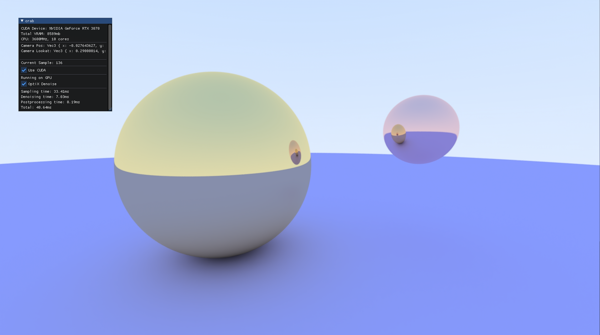

# CUDA + Rust examples

The examples in here showcase both the GPU side and the CPU side of writing a tool which uses the GPU.

## [Interactive Path Tracer](cpu/path_tracer)

This example showcases a very simple interactive Path Tracer inspired by [Ray Tracing In One Weekend](https://raytracing.github.io/books/RayTracingInOneWeekend.html)
which runs on CPU or GPU, with the additional option of running OptiX denoising.

The Path Tracer uses cuda_builder to compile the core path tracer for the GPU and GPU (hardware raytracing), and uses the core path tracer as a normal crate
for CPU rendering and sharing structures.
