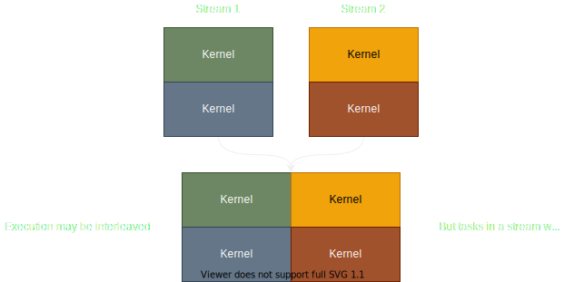

# Safety

With one of Rust's main foci being memory safety, we strive to make most things
safe, without requiring too much unsafe usage and mental checks from the user. However,
CUDA's inherent thread/memory model leaves many things ambiguous as to whether they are sound
and makes many invariants inherently impossible to statically prove. In this section
we will talk about what kinds of behavior is considered undefined inside of kernels as 
well as the invariants that must be upheld by the caller of kernels.

⚠️ This list is not fully complete, as the semantics of Rust safety on the GPU have not been explored much,
however, this list includes most of the actions "regular" users may commit ⚠️

## Behavior considered undefined in GPU kernels

This list is purely meant to be a guide on what behavior should be avoided.

Undefined behavior on the GPU is defined as potentially being able to cause the following (but not limited to):
- Unknown/Undefined data being written to a location in memory.
- Causing fatal termination of either just the kernel (through trapping), or the entire CUDA driver (through invalid address errors).
- Causing LLVM/NVVM to optimize the code into unknown code.

Behavior considered undefined inside of GPU kernels:
- Most importantly, any behavior that is considered undefined on the CPU, is considered undefined
on the GPU too. See: https://doc.rust-lang.org/reference/behavior-considered-undefined.html.
The only exception being invalid sizes for buffers given to a GPU kernel.

Currently we declare that the invariant that a buffer given to a gpu kernel must be large enough for any access the
kernel is going to make is up to the caller of the kernel to uphold. This idiom may be changed in the future.

- Any kind of data race, this has the same semantics as data races in CPU code. Such as:
  - Multiple threads writing to a location in memory at the same time without synchronization.
  - One or more threads reading while a thread is writing to a memory location.
  - Reading shared memory while a thread is writing to the location (if for example `thread::sync` has not been called).

Behavior not currently considered undefined, but considered undesirable:
- calling `thread::sync` inside of a branch that not all threads inside of the thread block have reached.

## Behavior considered undefined on the CPU

This list will contain behavior that is considered undefined in the context of actually launching GPU kernels from
the CPU.

### Streams

Streams will always execute concurrently with eachother. That is to say, kernels launched
inside of a single stream guarantee that they will be executed one after the other, in order.

However, kernels launched in different streams have no guarantee of execution order, their execution
may be interleaved and kernels are likely to be launched concurrently on the GPU.



Therefore, it is undefined behavior to write to the same memory location in kernels executed in different
streams without synchronization.

For example:
1: `Foo` is allocated as a buffer of memory on the GPU.
2: Stream `1` launches kernel `bar` which writes to `Foo`.
3: Stream `2` launches kernel `bar` which also writes to `Foo`.

This is undefined behavior because the kernels are likely to be executed concurrently, causing a data
race when multiple kernels try to write to the same memory.

However, if the thread that Stream `2` is located on calls `synchronize()` on Stream `1` before launching the kernel,
this will be sound. Because `synchronize()` waits for Stream `2` to finish all of its tasks before giving back control
to the calling thread.

Another important detail is that GPU operations on a stream are NOT synchronized with the CPU. 
This means that CPU code may not rely on a kernel being finished without calling `synchronize()`. For example:

```rs
launch!(module.bar<<<1, 1, 0, stream>>>(foo.as_unified_ptr()))?;
// 'bar' is not guaranteed to be finished executing at this point.
function_that_accesses_foo(foo);
stream.synchronize()?;
// foo may be accessed and will see the changes that 'bar' wrote to 'foo'. 'bar' is guaranteed 
// to be finished executing.
```

### Contexts

Contexts are akin to CPU processes, therefore, it is undefined behavior (although it should always yield an invalid address error) to
access another context's allocated GPU memory. 

However, this is very uncommon because single-device code should not need multiple contexts generally. This only becomes relevant
when using multiple devices (multi-GPU code) with different contexts.

Note however, that unified memory can be accessed by multiple GPUs and multiple contexts at the same time, as unified memory
takes care of copying and moving data automatically from GPUs/CPU when a page fault occurs. For this reason
as well as general ease of use, we suggest that unified memory generally be used over regular device memory.

### Kernel Launches

Kernel Launches are the most unsafe part of CUDA, many things must be checked by the developer to soundly launch a kernel.
It is fundamentally impossible for us to verify a large portion of the invariants expected by the kernel/CUDA.

The following invariants must be upheld by the caller of a kernel, failure to do so is undefined behavior:
- The number of parameters passed to the kernel must match the expected number of parameters.
- The dimensionality expected by the kernel must match, e.g. if the kernel expects 2d thread indices, it is undefined
behavior to launch the kernel with 3d thread indices (which would cause a data race). However, it is not undefined behavior
to launch the kernel with a dimensionality lower than expected, e.g. launching a 2d kernel with a 1d dimensionality.
- The types expected by the kernel must match:
  - If the kernel expects a struct, if the struct is repr(Rust), the struct must be the actual struct from the kernel library,
    otherwise, if it is repr(C) (which is reccomended), the fields must all match, including alignment and order of fields.
- Reference aliasing rules must not be violated, including:
  - Immutable references are allowed to be aliased, e.g. if a kernel expects `&T` and `&T`, it is sound to pass the same pointer for both.
  - Data behind an immutable reference must not be modified, meaning, it is undefined behavior to pass the same pointer to `&T` and `*mut T`,
  where `*mut T` is used for modifying the data. 
  - Parameters such as `&[UnsafeCell<T>]` must be exclusive, assuming the kernel uses the `UnsafeCell<T>` to modify the data.
  - `*mut T` does not necessarily need to follow aliasing rules, it is sound to pass the same pointer to two `*mut T` parameters
    assuming that the kernel accesses nonoverlapping regions of the memory. If a mutable reference is formed from
    the pointer, the mutable reference __must__ be exclusive, e.g. it is undefined behavior for two threads to create a mutable
    reference to the same element in a pointer.
- Any buffers passed to the kernel must be large enough for the size that the kernel expects. Allocated buffer size being correct
for what the kernel expects is up to the caller, not the kernel.
- Not allocating enough dynamic shared memory for how much the kernel expects.

Behavior that is not considered undefined but is undesirable:
- Launching a kernel with more threads than expected by its launch bounds (.maxntid in PTX). This will cause the launch to fail.
- Launching a kernel with a different number of threads than expected by its launch bounds (.reqntid in PTX). This will also cause the launch to fail.
